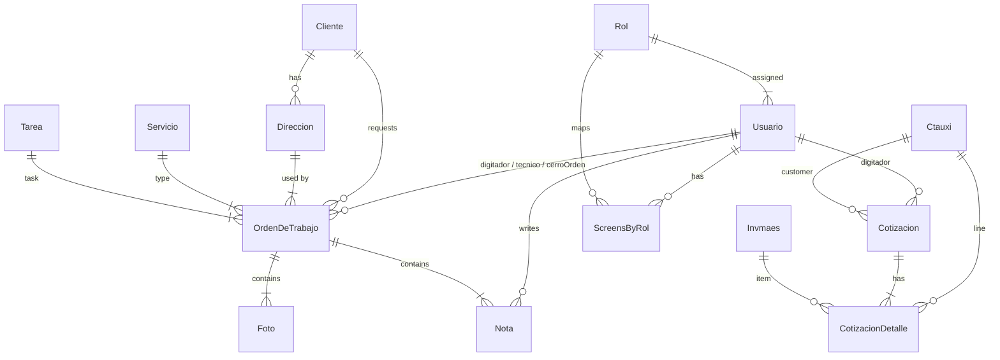

# MongoDB Schema Documentation

The project persists its data in MongoDB using [Mongoose](https://mongoosejs.com/). Below is a detailed overview of every model, its collection name, field structure, validation rules, and relationships to other documents.

**Notation**

* **Type** — JavaScript/Mongoose data type
* **Req.** — Field is required (`true` / `false`)
* **Default** — Default value if provided
* **Ref.** — Reference to another collection (when `type` is `ObjectId`)

---

## 1. Usuario

| Field | Type | Req. | Default | Ref. | Description |
| ----- | ---- | ---- | ------- | ---- | ----------- |
| `nombre` | String | false | — | — | Full name |
| `dui` | String | false | — | — | National ID |
| `nit` | String | false | — | — | Tax ID |
| `correoPrincipal` | String | false | — | — | Primary e-mail |
| `correoSecundario` | String | false | — | — | Secondary e-mail |
| `telefono` | String | false | — | — | Phone |
| `celular` | String | false | — | — | Mobile |
| `contrasenia` | String | false | — | — | Password (hashed) |
| `rol` | ObjectId | true | — | Rol | Role assigned to user |
| `notificaciones` | Boolean | false | — | — | Whether the user accepts notifications |

Collection name: `usuarios`

---

## 2. Rol

| Field | Type | Req. | Default | Ref. | Description |
| ----- | ---- | ---- | ------- | ---- | ----------- |
| `nombre` | String | true | — | — | Role name |

Collection: `rols`

---

## 3. Menu

| Field | Type | Req. | Default | Ref. | Description |
| ----- | ---- | ---- | ------- | ---- | ----------- |
| `nombre` | String | true | — | — | Menu title |
| `orden` | Number | true | — | — | Display order |
| `primeraPantallaRoot` | Boolean | false | `false` | — | Mark as default root screen |

Collection: `menus`

---

## 4. Screen

| Field | Type | Req. | Default | Ref. | Description |
| ----- | ---- | ---- | ------- | ---- | ----------- |
| `nombre` | String | true | — | — | Screen name |
| `descripcion` | String | false | — | — | Screen description |
| `path` | String | true | — | — | Client-side route path |
| `orden` | Number | true | — | — | Display order |
| `menu` | ObjectId | true | — | Menu | Parent menu |
| `param` | String | false | `""` | — | Optional route param |
| `mostrarEnMenu` | Boolean | false | — | — | Show/hide from navigation |

Collection: `screens`

---

## 5. ScreensByRol

Associative collection mapping screens to roles.

| Field | Type | Req. | Default | Ref. | Description |
| ----- | ---- | ---- | ------- | ---- | ----------- |
| `rol` | ObjectId | true | — | Rol | Role |
| `pantalla` | ObjectId | true | — | Screen | Screen |
| `soloLectura` | Boolean | false | `false` | — | Read-only flag |

Collection: `screensbyrols`

---

## 6. Servicio

| Field | Type | Req. | Default | Ref. | Description |
| ----- | ---- | ---- | ------- | ---- | ----------- |
| `nombre` | String | false | — | — | Service name |
| `orden` | Number | false | — | — | Display order |

Collection: `servicios`

---

## 7. Tarea

| Field | Type | Req. | Default | Ref. | Description |
| ----- | ---- | ---- | ------- | ---- | ----------- |
| `nombre` | String | false | — | — | Task name |
| `horas` | Number | false | — | — | Estimated hours |
| `orden` | Number | false | — | — | Display order |

Collection: `tareas`

---

## 8. Cliente

| Field | Type | Req. | Default | Ref. | Description |
| ----- | ---- | ---- | ------- | ---- | ----------- |
| `nombre` | String | false | — | — | Client name |
| `telefono` | String | false | — | — | Phone |
| `celular` | String | false | — | — | Mobile |
| `correo` | String | false | — | — | E-mail |
| `contacto` | String | false | — | — | Contact person |
| `nombre_busqueda` | String | false | — | — | Searchable name |
| `registro` | String | false | — | — | Registry info |
| `notas` | String | false | — | — | Notes |
| `mobileApp` | Boolean | false | `false` | — | Whether the client has an active mobile app user |

Collection: `clientes`

---

## 9. Direccion

| Field | Type | Req. | Default | Ref. | Description |
| ----- | ---- | ---- | ------- | ---- | ----------- |
| `cliente` | ObjectId | true | — | Cliente | Owner client |
| `direccion` | String | false | — | — | Address text |

Collection: `direccions`

---

## 10. Nota

| Field | Type | Req. | Default | Ref. | Description |
| ----- | ---- | ---- | ------- | ---- | ----------- |
| `ordenDeTrabajo` | ObjectId | true | — | OrdenDeTrabajo | Work order |
| `usuario` | ObjectId | true | — | Usuario | Author |
| `nota` | String | false | — | — | Content |
| `fecha` | Date | false | — | — | Timestamp |

Collection: `notas`

---

## 11. Foto

| Field | Type | Req. | Default | Ref. | Description |
| ----- | ---- | ---- | ------- | ---- | ----------- |
| `ordenDeTrabajo` | ObjectId | true | — | OrdenDeTrabajo | Work order |
| `nombre` | String | false | — | — | Stored filename |

Collection: `fotos`

---

## 12. OrdenDeTrabajo

Auto-incrementing sequence on `numero` (scoped by `aniomesprogramacion`).

| Field | Type | Req. | Default | Ref. | Description |
| ----- | ---- | ---- | ------- | ---- | ----------- |
| `estado` | String | false | — | — | Status | 
| `cliente` | ObjectId | true | — | Cliente | Client |
| `tecnico` | ObjectId | true | — | Usuario | Technician |
| `digitador` | ObjectId | true | — | Usuario | Digitizer |
| `cerroOrden` | ObjectId | false | — | Usuario | Closed by |
| `servicio` | ObjectId | true | — | Servicio | Service type |
| `tarea` | ObjectId | true | — | Tarea | Task performed |
| `fechaDigitacion` | Date | false | — | — | Date created |
| `fechaProgramada` | Date | false | — | — | Scheduled date |
| `fechaEjecucion` | Date | false | — | — | Execution date |
| `aniomesprogramacion` | String | false | — | — | YYYYMM key for sequence |
| `horaInicio` | String | false | — | — | Start time |
| `horaFinalizacion` | String | false | — | — | End time |
| `factura` | String | false | — | — | Invoice number |
| `direccion` | ObjectId | true | — | Direccion | Address |
| `numero` | Number | auto | — | — | Sequential number |
| `nombreFactura` | String | false | — | — | Invoice name |
| `CFF` | Boolean | false | — | — | With tax credit? |
| `notas` | String | false | — | — | Free notes |
| `nota` | ObjectId | false | — | Nota | Last note object |
| `resultadoGestion` | String | false | — | — | Management result |

Collection: `ordendetrabajos`

---

## 13. Servicio-related Aux Models

### 13a. Servicio (already listed)

### 13b. Tarea (already listed)

They provide master data used by `OrdenDeTrabajo`.

---

## 14. Registro (Login Tokens)

| Field | Type | Req. | Default | Ref. | Description |
| ----- | ---- | ---- | ------- | ---- | ----------- |
| `token` | String | false | — | — | JWT or UUID token |
| `usuarioId` | String | false | — | — | User ID (stringified) |

Collection: `registros`

---

## 15. pushSubscription

| Field | Type | Req. | Default | Ref. | Description |
| ----- | ---- | ---- | ------- | ---- | ----------- |
| `subscription` | Mixed | false | — | — | Push subscription object |
| `usuarioId` | String | false | — | — | Linked user ID |

Collection: `pushsubscriptions`

---

## 16. Cotizacion

Auto-increment sequence `numerocot_seq` for `numero`.

| Field | Type | Req. | Default | Ref. | Description |
| ----- | ---- | ---- | ------- | ---- | ----------- |
| `ctauxi` | ObjectId | true | — | Ctauxi | Customer (auxiliary account) |
| `digitador` | ObjectId | true | — | Usuario | Operator |
| `fecha` | Date | false | — | — | Date issued |
| `mensaje` | String | false | — | — | Custom message |
| `anombrede` | String | false | — | — | Issued in the name of |
| `total` | Number | false | `0` | — | Total amount |
| `formaDePago` | String | false | — | — | Payment terms |
| `validez` | String | false | — | — | Quote validity |
| `tiempoDeEntrega` | String | false | — | — | Delivery time |
| `numero` | Number | auto | — | — | Sequential quote number |

Collection: `cotizacions`

### CotizacionDetalle

| Field | Type | Req. | Default | Ref. | Description |
| ----- | ---- | ---- | ------- | ---- | ----------- |
| `cotizacion` | ObjectId | true | — | Cotizacion | Parent quote |
| `invmaes` | ObjectId | true | — | Invmaes | Product/service item |
| `cantidad` | Number | true | — | — | Quantity |
| `precio` | Number | true | — | — | Unit price |
| `descrip11111` | String | false | — | — | Description (typo-named) |

Collection: `cotizaciondetalles`

---

## 17. Invmaes / Invmaestmp (Inventory)

### Invmaes (active records)

| Field | Type | Req. | Default | Ref. | Description |
| ----- | ---- | ---- | ------- | ---- | ----------- |
| `idproducto` | String | true | — | — | Product code |
| `descrip` | String | false | — | — | Description |
| `modelo` | String | false | — | — | Model |
| `marca` | String | false | — | — | Brand |
| `pvum` | String | false | — | — | U/M price |
| `pvminpre` | Number | false | — | — | Minimum price |
| `precioven` | Number | false | — | — | Sales price |
| `proprecio` | Number | false | — | — | Proposed price |
| `saldo` | Number | false | — | — | Stock |
| `estado` | String | false | `"A"` | — | Status |

Collection: `invmaes`

### Invmaestmp (temporary imports)

Same structure as `Invmaes` but without `estado`.

Collection: `invmaestmps`

---

## 18. Ctauxi / Ctauxitmp

Extensive auxiliary-account information (customer ledger). Fields below are a subset.

| Field | Type | Req. | Default | Ref. | Description |
| ----- | ---- | ---- | ------- | ---- | ----------- |
| `idauxi` | String | true | — | — | Account code |
| `descrip` | String | false | — | — | Description / name |
| `telefono`, `fax` | String | false | — | — | Contact numbers |
| `direccion` | String | false | — | — | Address |
| `dui`, `nit` | String | false | — | — | Legal IDs |
| `limite` | Number | false | — | — | Credit limit |
| `estado` | String | false | `"A"` | — | Status (only on main collection) |
| … *many additional contact / representative fields* … |

Collection names:
* `ctauxis`
* `ctauxitmps` (temporary import buffer)

---

## 19. Utility & Sequence Collections

The two auto-increment plugins (`mongoose-sequence`) create hidden collections (`counters`) for maintaining sequences `numero_seq` and `numerocot_seq`. These are managed automatically by the plugin and rarely accessed directly.

---

### Entity Relationship Overview

This diagram highlights the key relationships among major collections.

---

### Naming Conventions & Indexes

* Collection names follow Mongoose's default pluralization (e.g., `Usuario` → `usuarios`).
* Auto-increment fields use the `mongoose-sequence` plugin—document insertion order is not guaranteed.
* No explicit indexes are declared aside from the implicit `_id` and sequence counters; consider creating additional indexes on high-traffic queries (e.g., `cliente`, `numero`, `estado`).

---

_Last updated: <<TODAY>>_ 